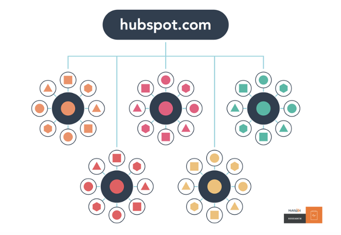
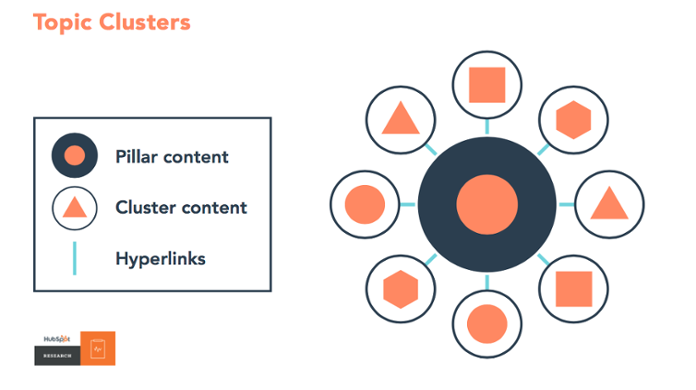

# WordPress Post Pillar Pages

Post Pillar Pages is a WordPress plugin to help you creating pillar pages for your SEO strategy. As posts in WordPress are not hierarchical you would have to use a page to create a pillar page. This would force you to use pages also for your topic clusters if you want to have your pillar page permalink inside your URL. With this plugin you can specify posts and pages to use as pillar pages. For every post or page ID specified a [Custom Post Type](https://codex.wordpress.org/Post_Types) is created.

## What is a pillar page?

Here's an example how [HubSpot illustrates](https://blog.hubspot.com/marketing/what-is-a-pillar-page) pillar pages:

All the big circles you see are your pillar pages. All the small circles are your topic clusters.

With this plugin you can use either a page or a post (or any other post type) as your pillar content page. For every pillar page a Custom Post Type is created which lets you add as much topic clusters as you want. If your pillarpage has the permalink `example.com/my-pillar-page/` any post added as a post in the custom post type has a permalink in this format: `example.com/my-pillar-page/my-topic-cluster-post/`.

## Installation

1. Download the plugin [here](https://github.com/SimonMayerhofer/wp-post-pillar-pages/releases).
2. Upload it to your WordPress installation and activate it.
3. Go to `Settings > Pillar Pages` and enter the IDs of the pages you want to use as pillar pages.
4. Save and also save your permalinks (`Settings > Permalinks`) again.

[You can find the IDs in the URL of the post / page edit screen.](https://www.google.com/search?q=find+wordpress+post+id)

## FAQ

### How to move a existing post to a custom post type?

There is a plugin called [Post Type Switcher](https://wordpress.org/plugins/post-type-switcher/) which lets you convert an existing post to a pillar page post type created by this plugin.

### What do I have to be aware of if I change the name or permalink of my pillar page?

If you only change the name you don't have to be aware of anything. If you change your permalink of a pillar page you need to save your permalink settings (`Settings > Permalinks`) in the WordPress back-end again.
Also be aware that you should create 301 redirects for your pillar page and all posts (topic clusters) created inside the custom post type.

If you have further questions please [create a new issue](https://github.com/SimonMayerhofer/wp-post-pillar-pages/issues/new).

## Contributing
Pull requests are welcome. For major changes, please open an issue first to discuss what you would like to change.